# MoreLogin MCP Tutorial

With MoreLogin MCP, you can control MoreLogin directly from MCP-supported AI tools (such as Claude, Cursor, etc.) using **natural language conversation**, enabling automation for "browser profile management" and "in-page automation".

> Supported actions include: starting browser profiles, creating profiles, visiting web pages in an open profile, typing text, clicking elements, taking screenshots, and more.

---

# 1. Configure MoreLogin MCP in Cursor

## Configuration Steps

1. Install and launch the MoreLogin client (V2.50.0 or later). If not yet installed, download the latest version from the official site: [MoreLogin Official Site](https://www.morelogin.com/)

2. Open the **API & MCP** section and wait for the "MoreLogin-mcp" program to finish downloading.

> After download, you do **not** need to install or configure Node.js locally.

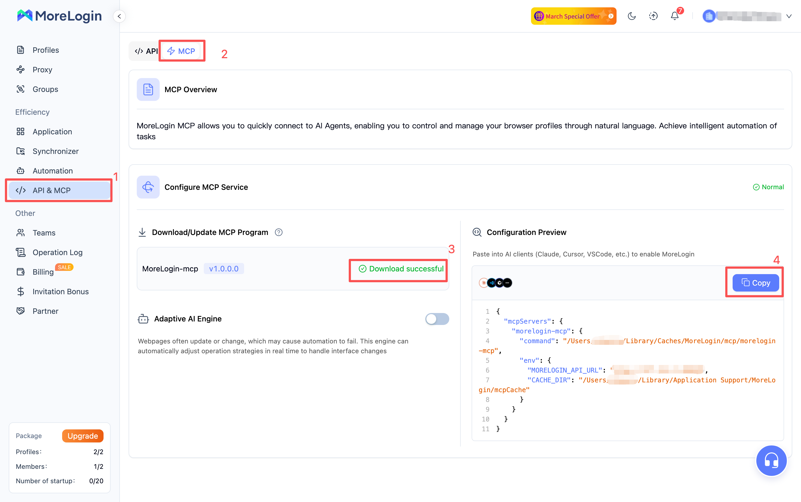

3. After "MoreLogin-mcp" has finished downloading, click **Copy** to copy the configuration content.

4. Launch the Cursor client, go to **Settings** → **Tools & MCP** → **Add Custom MCP**, and add the configuration.

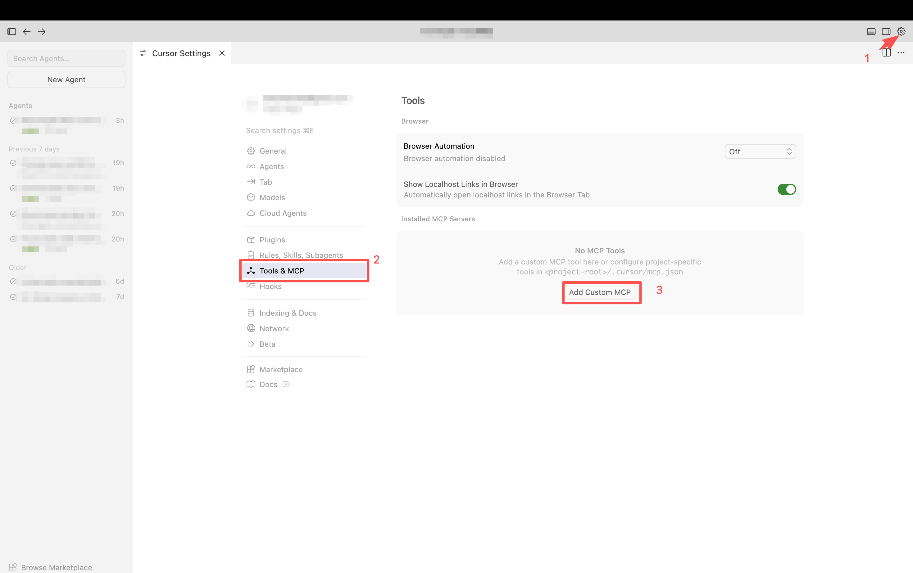

5. Paste the copied "MoreLogin-mcp" configuration into Cursor and press **Ctrl+S** (or **Cmd+S** on Mac) to save.

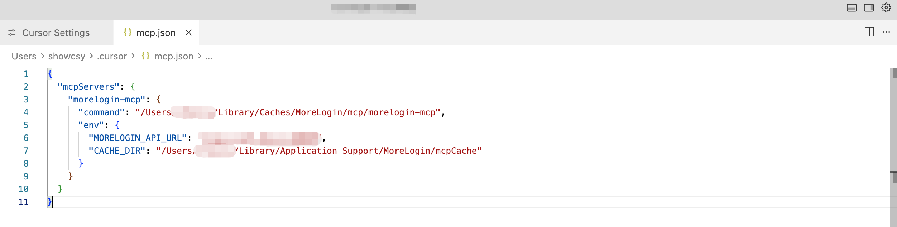

6. After saving, return to the **Installed MCP Servers** screen; seeing the "morelogin-mcp" entry means configuration succeeded.

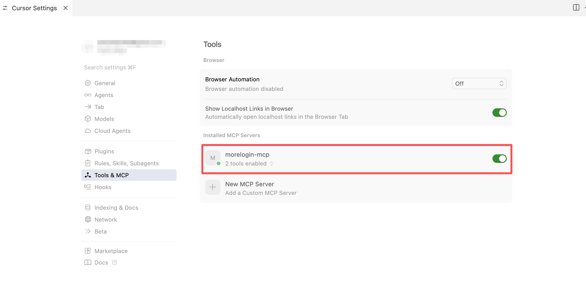

## Usage Examples

**Example 1: Automate browser profile management**

Enter natural language instructions in the Cursor chat. MoreLogin can be controlled automatically without manual steps.

> Example: *"Please create 2 Chrome, Windows profiles in MoreLogin."*  
> Cursor will call MoreLogin via MCP to create, start/close, or delete profiles as needed.

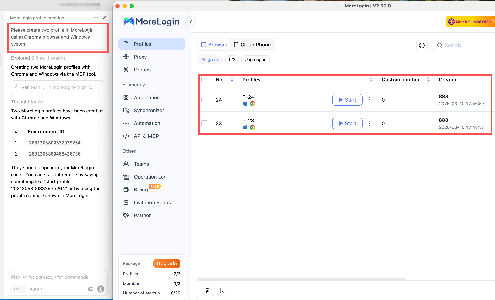

**Example 2: Automate in-page actions**

For existing profiles, you can open them and run in-page automation (navigate, type, click, screenshot).

> Example: *"Start the 'p-24' profile, go to www.google.com, type 'morelogin' in the search box, run the search, click the first result, and send me a screenshot."*

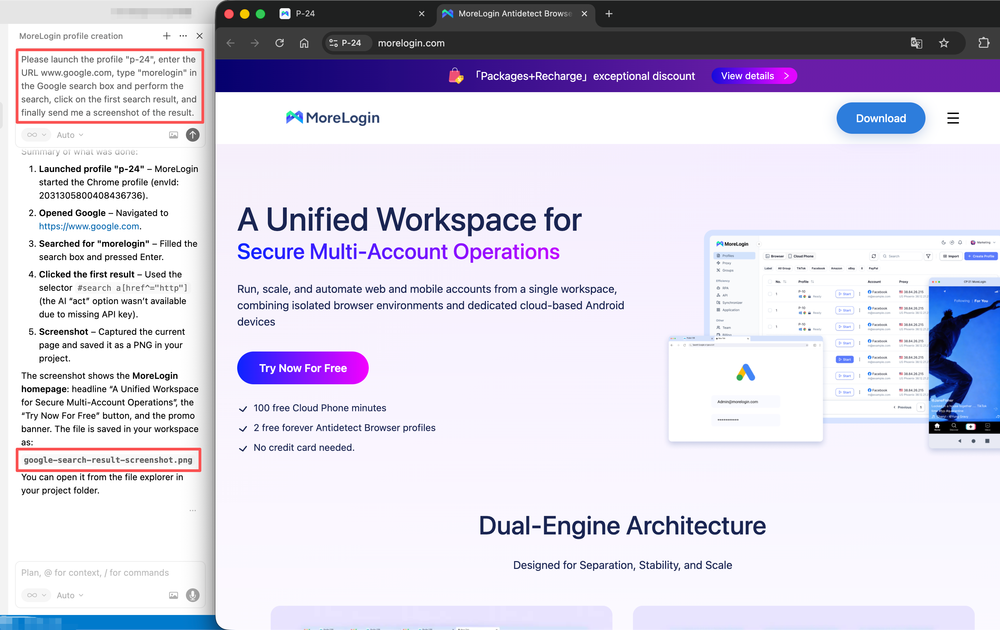

---

# 2. Configure MoreLogin MCP in Claude

## Configuration Steps

1. Launch the Claude client and go to **Settings** → **Developer** → **Edit Config** to open the config file for editing.

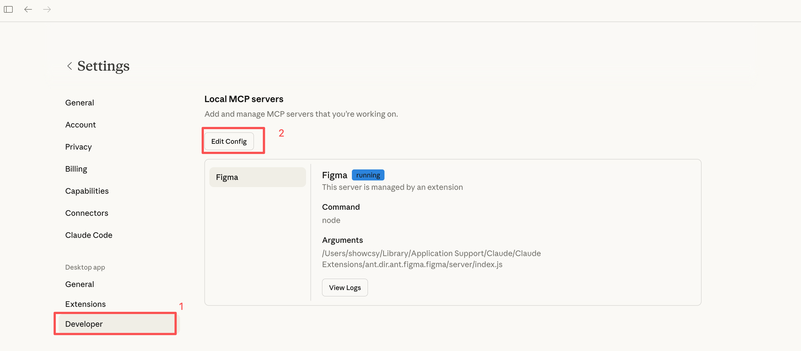

2. Open the local config file in a text editor, paste the MoreLogin MCP configuration (replacing the existing content if needed), then save with **Ctrl+S** (or **Cmd+S** on Mac).

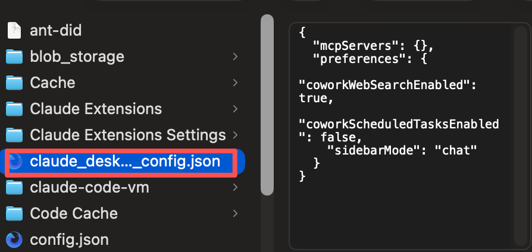

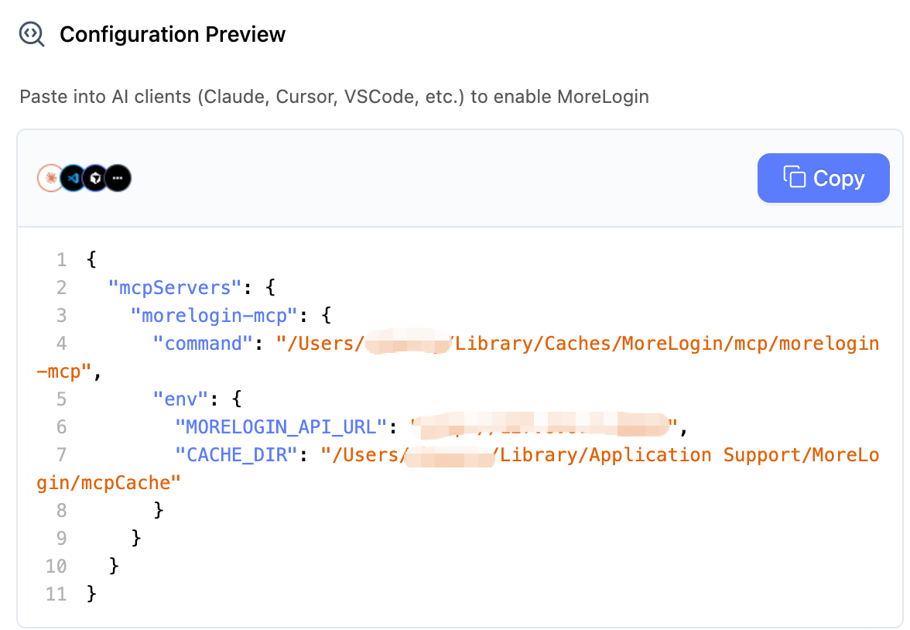

3. In **Settings** → **Connectors**, the presence of "morelogin-mcp" indicates that configuration succeeded.

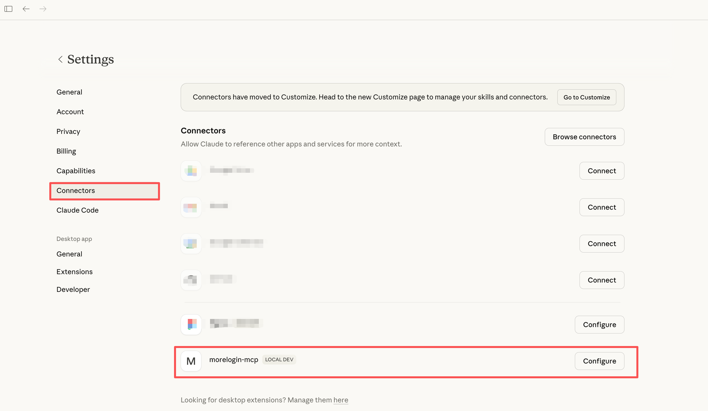

## Usage Examples

Enter natural language instructions in the Claude chat; Claude will call MoreLogin via MCP. Usage is the same as in Cursor.

1. **Profile management**: create, start/close, delete profiles, etc.
2. **In-page automation**: open URLs, type, click elements, take screenshots, etc.

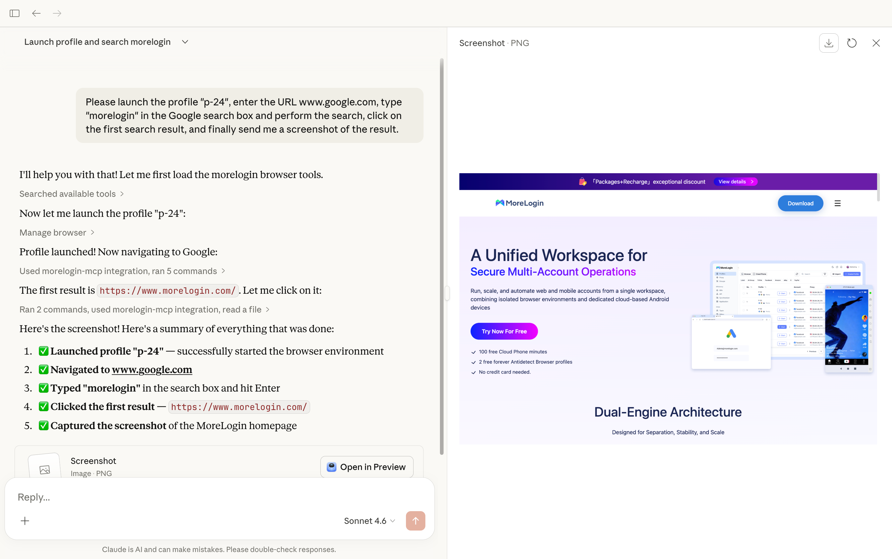

---

# 3. Adaptive AI Engine (Optional)

When automation flows are complex or page structure changes and breaks existing flows, you can configure an AI model and enable the adaptive engine. It adjusts the strategy in real time and adapts to page changes so automation stays reliable.

> **Use when**: page structure changes often, there are many dynamic elements, or you need flexible handling of edge cases.

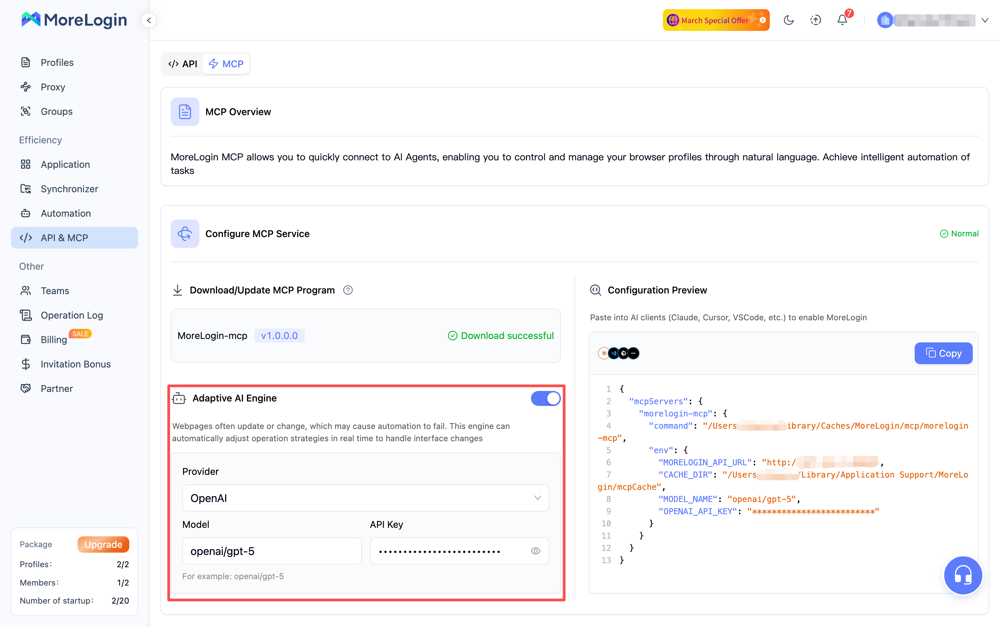
